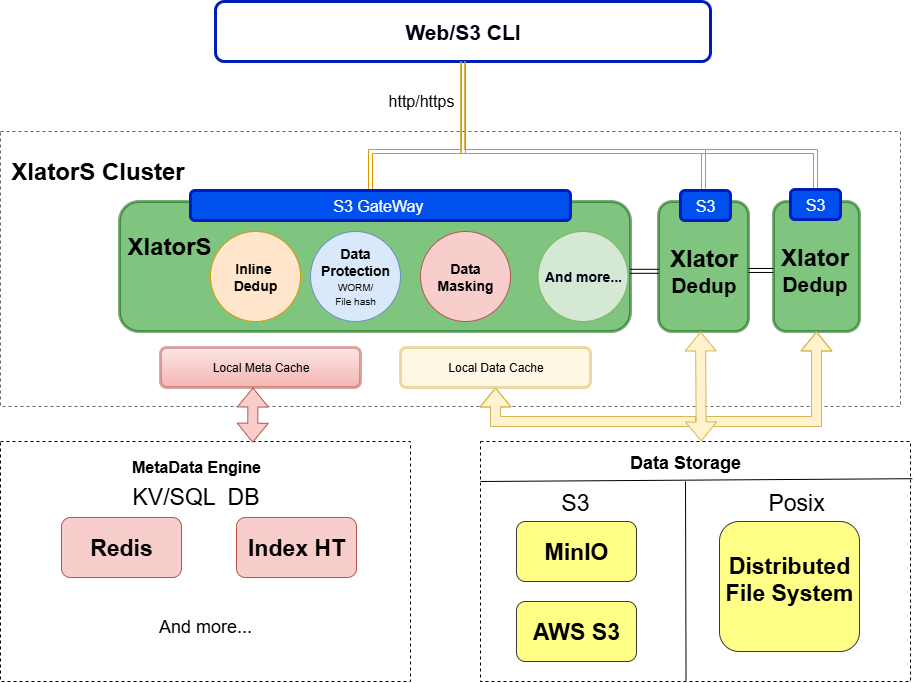
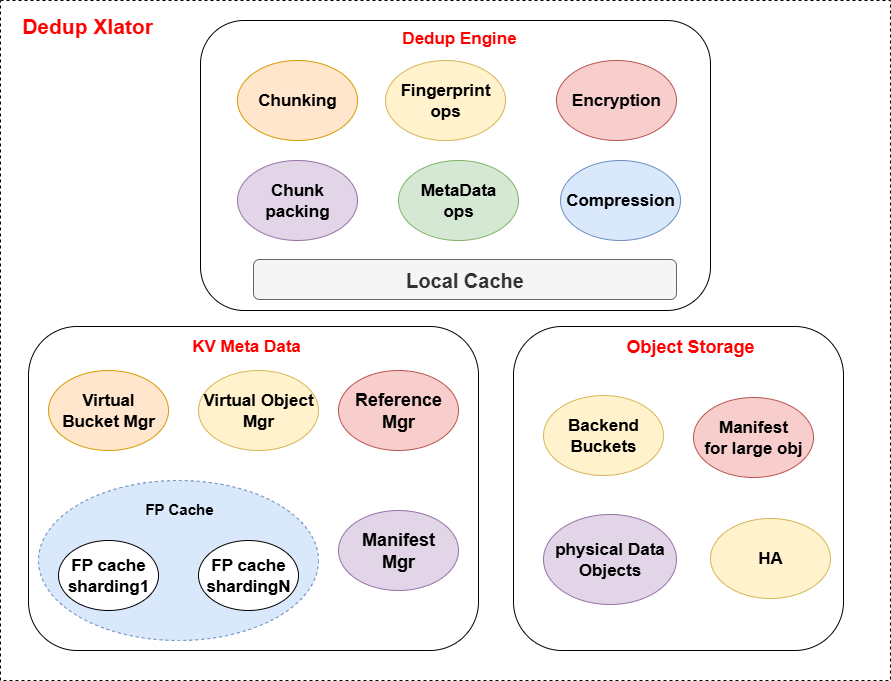
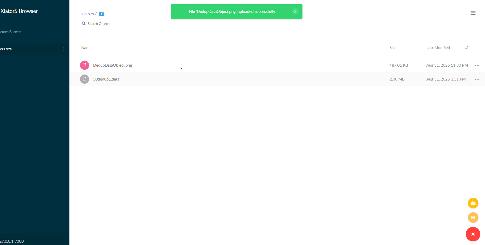

# XlatorS

XlatorS 是一个受 GlusterFS 架构启发而设计的高性能、可插拔的数据翻译层。

"Xlator" 是 "Translator"（翻译器）的缩写，而 "S" 可以代表存储（Store）、服务（Service）或它们的复数形式。它的核心思想是提供一个灵活的框架，允许数据在写入后端存储或从后端存储读出时，经过一个或多个“翻译器”的处理，从而实现如在线去重、数据加密、格式转换、内容审查等高级功能。

例如，你可以配置一个加密翻译器，在文件上传到云端前自动对其进行加密，而在下载时自动解密，从而确保数据在整个生命周期中的安全性。

## ✨ 功能特性

XlatorS 框架支持多种可插拔的数据翻译器，目前已实现的核心功能是**在线数据去重**。

* **S3接口**：XlatorS借助MinIO的开源代码（gateway）提供了一个功能完整、高性能的本地 S3 兼容存储， 并且根据不同的需求实现了S3 API绝大部分功能
* **在线数据去重 (Inline Deduplication)**: 在数据写入的主路径上实时进行去重处理，显著节省后端存储空间，并能在传输重复数据时提高有效吞吐率。

  * **多种分块算法**: 支持固定大小分块（Fixed-size Chunking）和基于内容的高级变长分块算法（如 FastCDC），以适应不同场景，最大化去重率。
  * **高性能指纹计算**: 使用 SHA256 计算数据块指纹，保证数据完整性。
  * **灵活多范围的去重策略**: 支持基于命名空间（Namespace）的**去重隔离**，可以实现**桶内**、**跨桶**甚至**全局**的去重策略。
  * **动态算法选择**: 支持在上传对象时，通过用户元数据（User Tags）动态指定本次上传所使用的分块算法，为不同类型的数据选择最优处理策略。
  * **多后端存储协议**：支持数据通过posix存在磁盘，也可以通过S3协议存向MinIO/AWS S3, 支持灵活配置和切换
  * **大文件上传**：针对大文件，利用S3接口的分块上传，来提高上传并发能力，最后整合文件元数据，此过程不会影响各切块之间的去重率
  * **数据高可用**：支持数据的高可用，由后端metadata和datastorage 组件来提供数据的高可用，比如MinIO里的EC等
  * **服务高可用**：因为Xlator是无状态服务，所以支持随启随用，轻松做到故障切换
  * **垃圾回收**：支持针对contianer级别的异步垃圾回收
* **可扩展的翻译器架构（未实现）**:

  * **数据保护 (Data Protection)**: 框架设计可支持 WORM (Write Once, Read Many)、文件哈希校验（如病毒检测）等功能。
  * **数据脱敏 (Data Masking)**: 可扩展支持在读写路径上对敏感数据进行脱敏，如对特定字段进行加密或屏蔽。
  * **自定义处理**: 用户可以根据需求，灵活地开发和配置自己的数据翻译器，如自定义压缩、加密算法等。

## 🏗️ 架构设计

XlatorS 系统主要由三大核心组件构成：**XlatorS 集群**、**元数据引擎**和**后端对象存储**。



* **XlatorS 集群**: 作为系统的核心处理层，由一个或多个无状态的 XlatorS 节点组成。所有来自客户端的 S3 请求都会经过 XlatorS 节点，数据流会被指定的翻译器（如 Dedup Xlator）进行处理，处理后的数据和元数据分别存入后端存储和元数据引擎。其无状态特性使得集群可以轻松地进行水平扩展和缩容。
* **元数据引擎 (MetaData Engine)**: 负责存储系统的所有元数据。对于去重场景，它存储了包括虚拟桶与对象信息、数据块指纹（Fingerprint）到数据对象（Data Object）的映射、数据对象的引用计数等关键信息。目前主要使用 **Redis** 作为元数据引擎，以保证高性能的读写。
* **后端对象存储 (Data Storage)**: 负责持久化存储经过翻译器处理后的数据。在去重场景下，这里存储的是由多个唯一数据块（Chunk）打包而成的数据对象（DObj）。任何兼容 S3 协议的对象存储（如 MinIO）都可以作为后端。

### Dedup Xlator 架构

作为核心功能之一，Dedup Xlator 的内部架构如下：



详细设计可以查看:

```
Xlator/doc/cn/Dedup/deduplication.md
```

## 🚀 快速开始

### 1. 环境要求

* **Go**: 版本 `1.24` 或更高。
* **Redis**: 用于元数据存储（目前暂时还存了index cache，后期会引入新的模块做优化）。
* **S3 兼容的对象存储**: 用作后端数据存储，例如 MinIO。

### 2. 安装与构建

```bash
# 1. 克隆项目仓库
git clone https://github.com/zhengshuai-xiao/XlatorS.git
cd XlatorS

# 2. 下载 Go 模块依赖
go mod tidy

# 3. 构建二进制文件
make build

# 4. 运行单元测试
make test
```

### 3. 配置与运行

```
# 1. 配置XlatorX gateway 的credentail
export MINIO_ROOT_USER=minio
export MINIO_ROOT_PASSWORD=minioadmin
注：如果后端存储使用MinIO,需要使用相同的credential

# 2. 配置与启动依赖服务
#    a.启动redis-server
     b.启动MinIO server
	例如：minio server --address 127.0.0.1:9001 /data &

# 3. (可选) 配置 FastCDC 分块大小 (单位: 字节)
export XL_DEDUP_FASTCDC_MIN_SIZE=65536   # 64KiB
export XL_DEDUP_FASTCDC_AVG_SIZE=131072  # 128KiB
export XL_DEDUP_FASTCDC_MAX_SIZE=262144  # 256KiB

# 4. 运行 XlatorS Dedup服务
#    --ds-backend: 数据块 (DObj) 的后端存储类型。
#                  "posix" (默认): 数据块仅存储在本地 POSIX 文件系统。
#                  "s3": 数据块存储在本地，并上传到后端的 S3 存储。

启动后端存储为本地的Dedup服务
./bin/xlators gateway  --xlator Dedup --ds-backend posix --meta-addr 127.0.0.1:6379/1 --loglevel trace --downloadCache /dedup_data/

启动后端存储为MinIO的Dedup服务
./xlators gateway  --xlator Dedup --ds-backend s3 --backend-addr http://127.0.0.1:9001 --meta-addr 127.0.0.1:6379/1  --loglevel trace

```

### 4. 使用示例

你可以通过xlators 提供的简单的weiUI来进行创建/删除 bucket， 上传/下载/删除object，注：这个UI使用的minio一个老版本的weiUI，因此功能比较单一

可以通过启动时的提示找到endpoint等相关信息

```
Endpoint: http://127.0.0.1:9000

Browser Access:
   http://127.0.0.1:9000

Object API (Amazon S3 compatible):
   Go:         https://docs.min.io/docs/golang-client-quickstart-guide
   Java:       https://docs.min.io/docs/java-client-quickstart-guide
   Python:     https://docs.min.io/docs/python-client-quickstart-guide
   JavaScript: https://docs.min.io/docs/javascript-client-quickstart-guide
   .NET:       https://docs.min.io/docs/dotnet-client-quickstart-guide

```



你也可以使用项目提供的 `./bin/xcli` 工具来上传文件，并动态指定分块算法。

* **指定使用定长分块 (FixedCDC) 算法上传**

```
zxiao@localhost:/workspace/X/XlatorS$ bin/xcli upload --help
NAME:
   xcli upload - Upload a local file to MinIO/XlatorS

USAGE:
   xcli upload [command options]

OPTIONS:
   --bucket value        Target bucket name
   --local-file value    Path to local file to upload
   --object-name value   Name for the object in MinIO (optional, uses local filename if empty)
   --disable-multipart   Disable multipart upload (default: false)
   --partSize value      Part size for multipart upload (default: 1073741824)
   --chunk-method value  Chunking algorithm to use (FastCDC or FixedCDC) (default: "FastCDC")
   --help, -h            show help

zxiao@localhost:/workspace/X/XlatorS$ /workspace/X/XlatorS/bin/xcli --endpoint "127.0.0.1:9000" upload --bucket xzs.xzs --local-file /tmp/50dedup200M.data --object-name 50dedup200M.data  --partSize 10485760 --chunk-method FixedCDC
File uploaded successfully:
  Bucket:     xzs.xzs
  Object:     50dedup200M.data
  Size:       209715200 bytes
  ETag:       2cdd93ba2618005da199dc7b9df57706-20
  Time taken: 1.163738887s
  Throughput: 171.86 MB/s

Dedup xlator log:
2025/08/31 23:38:22.276495 XlatorDedup[5581] <INFO>: Successfully completed multipart upload for xzs.xzs/50dedup200M.data, size: 209715200, wrote: 104864800, dedupRate: 50.00%, ETag: 2cdd93ba2618005da199dc7b9df57706-20 [CompleteMultipartUpload@xlator_dedup.go:760]

=================get========================
zxiao@localhost:/workspace/X/XlatorS$ /workspace/X/XlatorS/bin/xcli --endpoint "127.0.0.1:9000" download --bucket xzs.xzs  --object-name 50dedup200M.data --local-file /tmp/50dedup200M.data.cp
Object downloaded successfully:
  From:       s3://xzs.xzs/50dedup200M.data
  To:         /tmp/50dedup200M.data.cp
  Size:       209715200 bytes
  Time taken: 294.710689ms
  Throughput: 678.63 MB/s
zxiao@localhost:/dedup_data$ md5sum /tmp/50dedup200M.data /tmp/50dedup200M.data.copy
f3d1e82711b27546d4b3b3cd6c1de07f  /tmp/50dedup200M.data
f3d1e82711b27546d4b3b3cd6c1de07f  /tmp/50dedup200M.data.cp

```

* **使用默认的 FastCDC 算法上传文件** :
  ```
  zxiao@localhost:/workspace/X/XlatorS$ /workspace/X/XlatorS/bin/xcli --endpoint "127.0.0.1:9000" upload --bucket xzs.xzs --local-file /tmp/50dedup200M.data --object-name 50dedup200M.data1 --disable-multipart true
  File uploaded successfully:
    Bucket:     xzs.xzs
    Object:     50dedup200M.data1
    Size:       209715200 bytes
    ETag:       d41d8cd98f00b204e9800998ecf8427e
    Time taken: 1.160631531s
    Throughput: 172.32 MB/s

  Dedup xlator log:
  2025/08/31 23:41:31.758537 XlatorDedup[5581] <INFO>: Successfully put object xzs.xzs/50dedup200M.data1, size: 209715200, wrote: 105979749, dedupRate: 49.46%, compressRate: -0.00%, ETag: d41d8cd98f00b204e9800998ecf8427e, elapsed: 829.952063ms, throughput: 240.98 MB/s [PutObject@xlator_dedup.go:491]
  ```

**注意** : 桶的命名需要遵循 `namespace.bucketname` 的格式，这用于实现基于命名空间的去重隔离。

## 🧪 自动化端到端测试

项目提供了一个自动化的端到端测试脚本，用于验证整个系统的核心功能。

要运行测试，请确保你已经开启了redis service ~~安装了 `docker` 和 `docker-compose`~~，然后在项目根目录下执行下面两种命令中的一个：

```
make auto-test
```

或者

```bash
./automation/run_e2e_test.sh
```

## 🐳 使用 Docker 运行

项目提供了 `Dockerfile`，可以方便地将 XlatorS 作为容器运行。

### 1. 构建 Docker 镜像

在项目根目录下，运行以下命令构建镜像：

```bash
docker build -t xlators-app .
```

### 2. 运行容器

首先你需要一个正在运行的 Redis 实例， 以下是两种常见的运行模式：

#### 模式一：使用本地 POSIX 文件系统作为后端

这是默认且最简单的模式，数据块将存储在容器内或挂载的本地目录中。

```bash
docker run -d --name xlators-gateway \
-p 9000:9000  \
-v "/docker/xlators_data":/xlators_data \
-v "/docker/xlators_logs":/xlators_log \
-e "MINIO_ROOT_USER=minio" \
-e "MINIO_ROOT_PASSWORD=minioadmin"  \
xlators-app gateway \
--address ":9000" \
--xlator "Dedup" \
--ds-backend "posix" \
--meta-addr "your-redis:6379/1" \
--downloadCache "/xlators_data" \
--loglevel "trace" \
--logdir "/xlators_log"
```

#### 模式二：使用 S3 兼容存储作为后端

你需要一个正在运行的 MinIO 或其他 S3 兼容服务。

```bash
docker run -d --name xlators-gateway \
-p 9000:9000  \
-v "/docker/xlators_data":/xlators_data \
-v "/docker/xlators_logs":/xlators_log \
-e "MINIO_ROOT_USER=minio" \
-e "MINIO_ROOT_PASSWORD=minioadmin"  \
xlators-app gateway \
--address ":9000" \
--xlator "Dedup" \
--ds-backend "s3" \
--backend-addr "http://127.0.0.1:9001" #your minIO Endpoint\
--meta-addr "your-redis:6379/1" \
--downloadCache "/xlators_data" \
--loglevel "trace" \
--logdir "/xlators_log"
```

## 许可证

本项目根据 Apache License 2.0 授权。

**联系我：zhengshuai.xiao@outlook.com**
