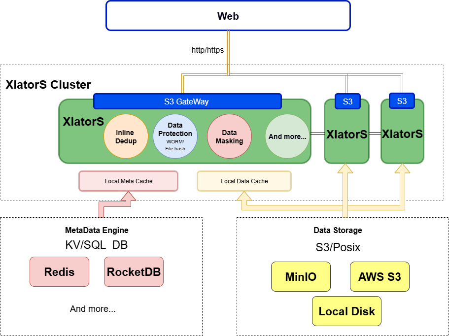

# XlatorS

XlatorS 是一个受 GlusterFS 架构启发而设计的高性能、可插拔的数据翻译层。

"Xlator" 是 "Translator"（翻译器）的缩写，而 "S" 可以代表存储（Store）、服务（Service）或它们的复数形式。它的核心思想是提供一个灵活的框架，允许数据在写入后端存储或从后端存储读出时，经过一个或多个“翻译器”的处理，从而实现如在线去重、数据加密、格式转换、内容审查等高级功能。

例如，你可以配置一个加密翻译器，在文件上传到云端前自动对其进行加密，而在下载时自动解密，从而确保数据在整个生命周期中的安全性。

## ✨ 功能特性

XlatorS 框架支持多种可插拔的数据翻译器，目前已实现的核心功能是**在线数据去重**。

* **在线数据去重 (Inline Deduplication)**: 在数据写入的主路径上实时进行去重处理，显著节省后端存储空间，并能在传输重复数据时提高有效吞吐率。

  * **多种分块算法**: 支持固定大小分块（Fixed-size Chunking）和基于内容的高级变长分块算法（如 FastCDC），以适应不同场景，最大化去重率。
  * **高性能指纹计算**: 使用 SHA256 计算数据块指纹，保证数据完整性。
  * **灵活的去重域**: 支持基于命名空间（Namespace）的去重隔离，可以实现桶内、跨桶甚至全局的去重策略。
  * **动态算法选择**: 支持在上传对象时，通过用户元数据（User Tags）动态指定本次上传所使用的分块算法，为不同类型的数据选择最优处理策略。
* **可扩展的翻译器架构**:

  * **数据保护 (Data Protection)**: 框架设计可支持 WORM (Write Once, Read Many)、文件哈希校验（如病毒检测）等功能。
  * **数据脱敏 (Data Masking)**: 可扩展支持在读写路径上对敏感数据进行脱敏，如对特定字段进行加密或屏蔽。
  * **自定义处理**: 用户可以根据需求，灵活地开发和配置自己的数据翻译器，如自定义压缩、加密算法等。

## 🏗️ 架构设计

XlatorS 系统主要由三大核心组件构成：**XlatorS 集群**、**元数据引擎**和**后端对象存储**。



* **XlatorS 集群**: 作为系统的核心处理层，由一个或多个无状态的 XlatorS 节点组成。所有来自客户端的 S3 请求都会经过 XlatorS 节点，数据流会被指定的翻译器（如 Dedup Xlator）进行处理，处理后的数据和元数据分别存入后端存储和元数据引擎。其无状态特性使得集群可以轻松地进行水平扩展和缩容。
* **元数据引擎 (MetaData Engine)**: 负责存储系统的所有元数据。对于去重场景，它存储了包括虚拟桶与对象信息、数据块指纹（Fingerprint）到数据对象（Data Object）的映射、数据对象的引用计数等关键信息。目前主要使用 **Redis** 作为元数据引擎，以保证高性能的读写。
* **后端对象存储 (Data Storage)**: 负责持久化存储经过翻译器处理后的数据。在去重场景下，这里存储的是由多个唯一数据块（Chunk）打包而成的数据对象（DObj）。任何兼容 S3 协议的对象存储（如 MinIO）都可以作为后端。

### Dedup Xlator 架构

作为核心功能之一，Dedup Xlator 的内部架构如下：


## 🚀 快速开始

### 1. 环境要求

* **Go**: 版本 `1.24` 或更高。
* **Redis**: 用于元数据存储。
* **S3 兼容的对象存储**: 用作后端数据存储，例如 MinIO。

### 2. 安装与构建

```bash
# 1. 克隆项目仓库
git clone https://github.com/zhengshuai-xiao/XlatorS.git
cd XlatorS

# 2. 下载 Go 模块依赖
go mod tidy

# 3. 构建二进制文件
make build
```

### 3. 配置与运行

```
# 1. 配置后端 S3 存储地址
export BACKEND_ADDR="127.0.0.1:9000"

# 2. 配置 Redis 地址
export META_ADDR="127.0.0.1:6379"

# 3. (可选) 配置 FastCDC 分块大小 (单位: 字节)
export XL_DEDUP_FASTCDC_MIN_SIZE=65536   # 64KiB
export XL_DEDUP_FASTCDC_AVG_SIZE=131072  # 128KiB
export XL_DEDUP_FASTCDC_MAX_SIZE=262144  # 256KiB

# 4. 运行 XlatorS Dedup服务
#    --ds-backend: 数据块 (DObj) 的后端存储类型。
#                  "posix" (默认): 数据块仅存储在本地 POSIX 文件系统。
#                  "s3": 数据块存储在本地，并上传到后端的 S3 存储。
./bin/xlators gateway --address ":8000" --ds-backend "posix"

```

### 4. 使用示例

你可以使用项目提供的 `./bin/xc` 工具来上传文件，并动态指定分块算法。

* **使用默认的 FastCDC 算法上传文件** :

```
go run utils/upload_file.go \
  --endpoint "127.0.0.1:8000" \
  --bucket "your-namespace.test-bucket" \
  --local-file "/path/to/your/file.dat"
```

* **指定使用定长分块 (FixedCDC) 算法上传**

```
go run utils/upload_file.go \
  --endpoint "127.0.0.1:8000" \
  --bucket "your-namespace.test-bucket" \
  --local-file "/path/to/your/file.dat" \
  --chunk-method "FixedCDC"
```

**注意** : 桶的命名需要遵循 `namespace.bucketname` 的格式，这用于实现基于命名空间的去重隔离。
