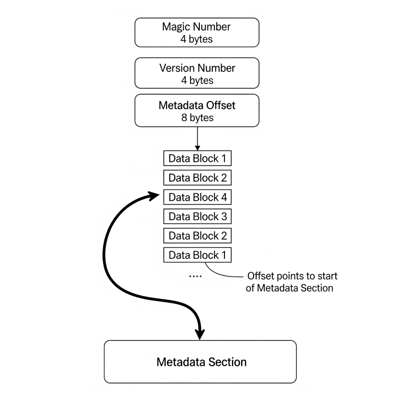

# Deduplication

## 简介

重删技术一般分两大类，在线重删（**Inline-deduplication**）和后期重删（**Post-process deduplication**），可以把他们分别比喻为翻译中的**同声传译** 和 **文献翻译**（：自我感觉这个比喻还挺恰当的：）

概念的东西不赘述了，直接上结论：XlatorS 采用的在线重删，原因来自于它的架构，post-process 不是不能做，而是没必要，会给存储系统增加额外的读写带宽，这不是一个翻译该做的事了

在线重删在二级存储（备份/冷数据）领域应用极广，会给一下方面带来好处：

1. 减少存储空间的使用
2. 提高针对重复数据的传输带宽（ThroughPut）
3. 可以多版本保留

但也带来很多挑战

1. 小数据读写的时延
2. 元数据的管理
3. 切块后数据的整合及在磁盘空间的管理
4. 指纹的缓存/查询
5. 分布式系统
6. 数据修改带来的引用问题
7. 数据高可用和一致性

## 架构

Dedup Xlator 由以下几个模块组成


Dedup Engine: 作为引擎，它的所有元数据以及配置数据都由KV Meta Data 提供, 因此服务本身是无状态的，可以随启随用，不局限于某个Dedup Engine，它由一下几个子模块组成：

* Chunking：数据切块， 目前使用切块算法：
  1. 定长切块
  2. rabin chunking:  refer to <*Michael O. Rabin. Fingerprinting by random polynomials. Report TR-15-81, Center for Research in Computing Technology, Harvard University, 1981.>*
  3. GearCDC:  refer to <*XIA,W., JIANG, H., FENG, D., TIAN, L., FU, M.,AND ZHOU, Y. Ddelta: A deduplication-inspired fastdelta compression approach. Performance Evaluation 79(2014), 258–272.*>
  4. FastCDC:  refer to <*FastCDC: a Fast and Efficient Content-Defined Chunking Approach for Data Deduplication*>
* Fingerprint ops:
  1. 计算指纹， SHA1/SHA2
  2. 指纹查重
  3. 记录原Object的数据块清单（manifest）
* Chunk packing: 对切的数据块重新打包成一个大的Object，存储到Object Storage里
* MetaData ops: 提交元数据：
  1. Object 元数据
  2. manifest
  3. Reference
* Encryption:数据块加密
* Compression：数据块压缩

KV Meta Data:元数据存储，目前支持KV方式

* Dedup Namespace（DDNS）: 用这个命名空间来做dedup的隔离，它与后面的Backend Bucket 是严格一一对应的。
* Virtual Bucket Mgr: 这里的桶和Object Storage里的桶并不是一一对应的，所以需要管理前端S3传入的桶，并映射到对象存储里的桶，通常情况下这是多对一的关系
* Virtual Object Mgr: 同样的这里的Object也是前端S3.PutObject传入的对象，和对象存储里的是不一样的，映射关系在manifest里
* Manifest Mgr: 对象的引用关系
* Reference Mgr: 管理对象存储里对象与Meta Data里对象的引用关系，GC的时候会用到
* FP Cache: 针对指定的DDNS的指纹集合，用于重删

Object Storage:对象存储，支持S3 协议

* Backend Buckets: 对象存储的桶
* Manifest: 对于较大数据，需要存入到对象存储里
* physical data object: 写盘的对象
* HA: 支持数据高可用：例如MinIO里的EC Storage

## 关键数据结构和概念

**DD Namespace**

```
What is DD namespace?
Namespace is a string, it comes with bucketName
So the format of intput bucket name is namespace.bucket
Dedup Xlator gets namespace from bucket name.

What does DD namespace use?
all object in same DD namespace share same fp cache, in another words:
they do deduplication within same DD namespace
so it is the boundary of deduplication
```


```
//BucketOptions represents bucket options for ObjectLayer bucket operations
// I would like to implement glouble dedup in same namespace
type BucketOptions struct {
    Location          string
    LockEnabled       bool
    VersioningEnabled bool
}
```

**Buckets in redis**

```
HKey:Buckets
key: BucketName1 string, val:BucketInfo1
key: BucketName2 string, val:BucketInfo2
key: BucketName3 string, val:BucketInfo3
...

//above bucketName is with namespace

```

```
type BucketInfo struct {
	// Name of the bucket.
	Name string

	// Date and time when the bucket was created.
	Created time.Time
	...
}
```

**Objects in redis**

```
Hkey:Bucket name
key:obj1 string, val:objInfo1 jsonformat
key:obj2 string, val:objInfo2 jsonformat
...
```

```
type ObjectInfo struct {
	// Name of the bucket.
	Bucket string

	// Name of the object.
	Name string

	// Date and time when the object was last modified.
	ModTime time.Time

	// Total object size.
	Size int64

	// IsDir indicates if the object is prefix.
	IsDir bool

	// Hex encoded unique entity tag of the object.
	ETag string

	// The ETag stored in the gateway backend
	InnerETag string

	// Version ID of this object.
	VersionID string

	// IsLatest indicates if this is the latest current version
	// latest can be true for delete marker or a version.
	IsLatest bool

	// DeleteMarker indicates if the versionId corresponds
	// to a delete marker on an object.
	DeleteMarker bool

	// TransitionStatus indicates if transition is complete/pending
	TransitionStatus string

	// RestoreExpires indicates date a restored object expires
	RestoreExpires time.Time

	// RestoreOngoing indicates if a restore is in progress
	RestoreOngoing bool

	// A standard MIME type describing the format of the object.
	ContentType string

	// Specifies what content encodings have been applied to the object and thus
	// what decoding mechanisms must be applied to obtain the object referenced
	// by the Content-Type header field.
	ContentEncoding string

	// Date and time at which the object is no longer able to be cached
	Expires time.Time

	// CacheStatus sets status of whether this is a cache hit/miss
	CacheStatus CacheStatusType
	// CacheLookupStatus sets whether a cacheable response is present in the cache
	CacheLookupStatus CacheStatusType

	// Specify object storage class
	StorageClass string

	ReplicationStatus replication.StatusType
	// User-Defined metadata
	UserDefined map[string]string

	// User-Defined object tags
	UserTags string

	// List of individual parts, maximum size of upto 10,000
	Parts []ObjectPartInfo `json:"-"`

	// Implements writer and reader used by CopyObject API
	Writer       io.WriteCloser `json:"-"`
	Reader       *hash.Reader   `json:"-"`
	PutObjReader *PutObjReader  `json:"-"`

	metadataOnly bool
	versionOnly  bool // adds a new version, only used by CopyObject
	keyRotation  bool

	// Date and time when the object was last accessed.
	AccTime time.Time

	Legacy bool // indicates object on disk is in legacy data format

	// backendType indicates which backend filled this structure
	backendType BackendType

	VersionPurgeStatus VersionPurgeStatusType

	// The total count of all versions of this object
	NumVersions int
	//  The modtime of the successor object version if any
	SuccessorModTime time.Time
}
```

**FP Cache sharding**

```
key:fingerprint1 [32]byte, val:dataObjectID1 uint64
key:fingerprint2 [32]byte, val:dataObjectID1 uint64
key:fingerprint3 [32]byte, val:dataObjectID1 uint64
key:fingerprint4 [32]byte, val:dataObjectID1 uint64
...
```

**Manifest structure**

```
fingerprint1  size1  dataObjectID1
fingerprint2  size2  dataObjectID1
fingerprint3  size3  dataObjectID1
fingerprint4  size4  dataObjectID1
fingerprint5  size5  dataObjectID2
...
fingerprintM  sizeM  dataObjectID2
...
fingerprintN  sizeN  dataObjectID3
dataObjectID1
dataObjectID2
dataObjectID3
```

**Data Object in backend Bucket**



**Metadata in DataObject**

```
Fingerprint [32]byte
Offset uint64
Size   uint64
CRC32    uint32
...

```

**Reference Mgr**

```
HKey:Namespace_Ref
Key:dataObject1 uint64, val:objectName1,objectName2,objectName3... string
Key:dataObject2 uint64, val:objectName1,objectName4,objectName5... string
Key:dataObject3 uint64, val:objectName6,objectName7,objectName3... string
Key:dataObject4 uint64, val:objectName1,objectName2,objectName3... string
...
```

## 分布式

因为Dedup Xlator本身是无状态的，所以它可以随意扩展，后面会加入节点自动发现功能，这样可以做负载均衡

Meta Data: 目前采用的Redis集群，支持扩展，哨兵/集群等模式

Object Storage: 目前测试使用MinIO，MinIO支持集群模式

## 全局重删

在分布式架构下，Dedup Xlator支持自定义重删命名空间，它可以是单个Bucket内重删、也可以是多个Buckets间重删、也可以是全局重删，非常的灵活
