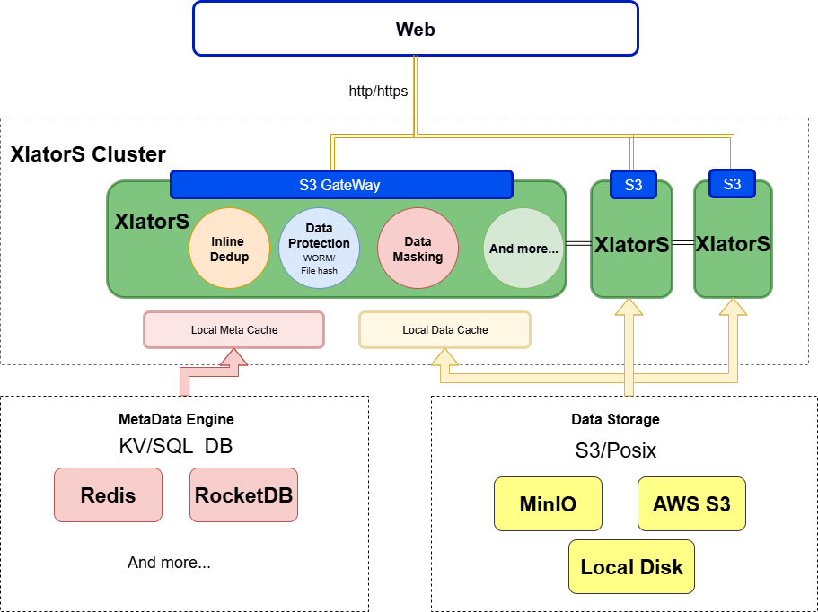

# XlatorS 架构设计

## 概述

我是一个翻译员，可以把各种数据翻译成你想要的样子。例如你有很多私密的文件，比如照片，它放在本地既占空间，还可能被人看见，那把它传到云端吧，可是这样也会被人看到，或者被窃取、泄露（服务商会为小客户单独加密数据吗？好像有些历史事件证明并不会），结果放哪里都不放心。如果你有一个非对称加密翻译，把私钥存放在受信任的客户端，任意地方存放公钥（公司、网吧）。使用翻译器（公钥）对图片加密，上传到云端，需要查看时，把它通过翻译器读到客户端即可，只要私钥不丢，根本不担心被偷窥：）

用上面简单的例子引出XlatorS, 请把XlatorS作为你的贴身保镖+保姆+贴心小宝贝（可以分享真心话的那种）

（我觉的我起的名字真不错，越看越喜欢）

## 架构

XlatorS 系统如图所示，分为以下几个模块：

XlatorS 集群:有每个XlatorS组成，前端过来的对象都会经过XlatorS,  数据会由指定的Xlator或Xlator组合来处理（翻译），翻译后的数据就会根据需要存入MetaData Engine 和Data Storage

XlatorS包含多种Xlator，例如：

* Inline Deduplication（在线重删功能），它会在主IO路径中对数据进行：切块 -> 算指纹 -> 查重 -> 引用 -> 数据写盘 -> 提交元数据 等操作最终达到数据重删的目的
* Data Protection（数据保护），数据保护是个很大的领域，这里主要针对数据存储安全方向：WORM、FileHash（病毒检测）等
* Data Masking（数据脱敏），在写/读数据时进行数据脱敏，例如对敏感数据做非对称加密...
* 数据分析、用户自定义数据加密/压缩等、集群调度

用户可以根据自己的需求灵活配置，甚至定义自己的数据翻译器。

MetaData Engine: 存放元数据信息，比如：当翻译前后的对象（Object）名或桶（Bucket）名不一一对应时，元数据里会存放对应的映射关系。元数据一般都是热数据，IO操作比较频繁， 所以目前使用Redis/RocketDB等...

## 部署

每个Xlator都是无状态的服务，它可以部署成客户端进行本地翻译，也可以部署成集群中做负载均衡，比如在线重删翻译器，当客户端无法进行CPU密集运算时，就需要其它的节点或集群进行翻译了。
